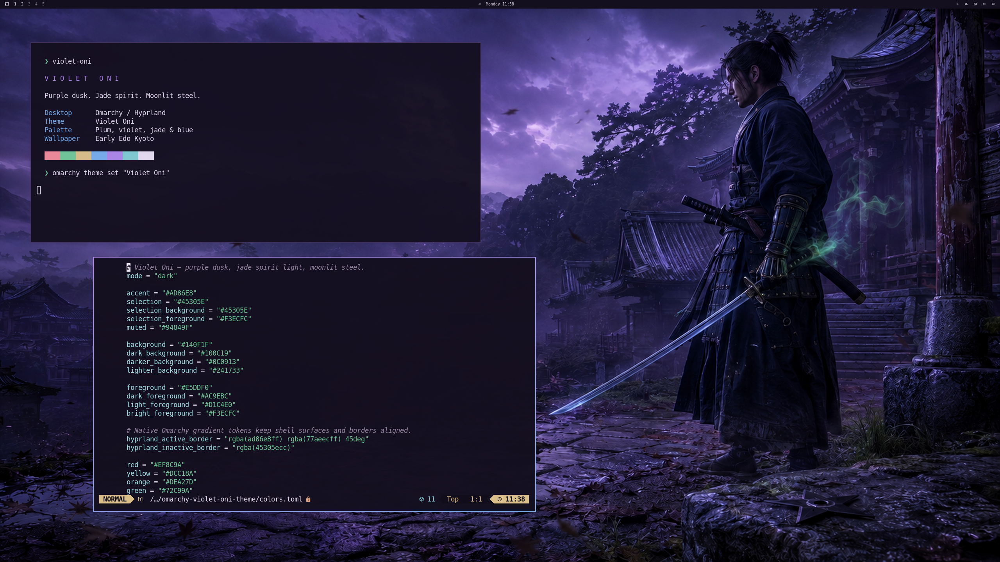
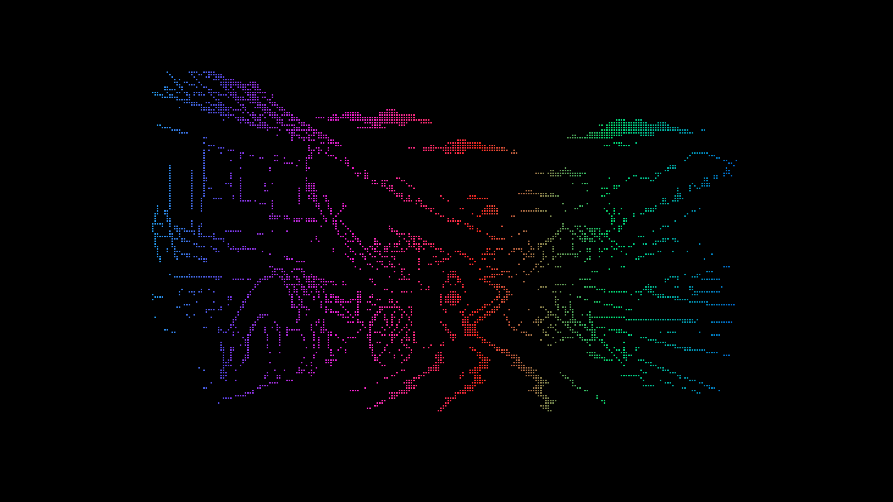

# Violet Oni

A dark purple [Omarchy](https://omarchy.org/) theme with jade-green and moonlit-blue accents, inspired by the early Edo Kyoto setting of **Onimusha: Way of the Sword**.



## Install

Copy this repository's public GitHub URL into **Install → Style → Theme** in the Omarchy menu, or run:

```bash
omarchy theme install https://github.com/DankCoder8360/omarchy-violet-oni-theme
```

After installation, choose **Violet Oni** in the theme selector or run:

```bash
omarchy theme set "Violet Oni"
```

Select any other theme through the same menu to switch back.

## Palette

| Role | Color |
| --- | --- |
| Background | `#140F1F` |
| Raised surface | `#241733` |
| Violet accent | `#AD86E8` |
| Jade green | `#72C99A` |
| Moonlit blue | `#77AEEC` |
| Foreground | `#E5DDF0` |

The complete palette includes distinct error, warning, cyan, and bright terminal colors. Main text has a 14.25:1 contrast ratio against the background.

## Omarchy integration

`colors.toml` is the source of truth. Omarchy generates the active terminal, Hyprland, shell, and application configurations from its own templates when the theme is selected. These cover Alacritty, Foot, Ghostty, Kitty, btop, Chromium, Neovim, Helix, VS Code, Obsidian, and the native bar, menus, notifications, OSD, and lock screen where those integrations are enabled.

Native gradient tokens provide violet-to-blue active borders, and `icons.theme` selects Omarchy's Yaru-purple icons. The theme keeps Omarchy's layout, font sizing, spacing, and display scaling. An optional screensaver helper is bundled and installed separately, as described below.

Validated against the Omarchy installation available on September 7, 2026: all 17 generated configurations resolved their templates; TOML/JSON parsed and Lua passed syntax checks. The screenshot above is a real 2560 × 1440 desktop with Alacritty and Neovim, reviewed after applying the theme. See [validation results](validation/report.json).

## Wallpaper and resolution

- [1440p wallpaper](backgrounds/01-violet-oni-2560x1440.png): 2560 × 1440, used by the theme.
- [4K export](artwork/violet-oni-3840x2160.png): 3840 × 2160.
- [Original selected source](artwork/violet-oni-source.png): 1672 × 941.

The cinematic wallpaper is AI-generated using the built-in image generation tool. The **1440p and 4K files are Lanczos-upscaled exports**, not native artwork at those resolutions. The real desktop screenshot is captured at 2560 × 1440; it is not an upscaled screenshot. The background composition works independently on multiple 16:9 monitors.

[Prompts and generation details](artwork/PROMPTS.md) are included. The earlier illustrative mockup is retained separately as `artwork/preview-concept.png`; it is not the gallery submission screenshot.

## Aftermath backgrounds

Four cinematic landscapes bring dusk-blue shadows, rich RGB highlights, and muted red sunsets to the purple interface. They depict the quiet aftermath and supernatural atmosphere of early Edo Japan, with weary travelers, damaged villages, shrine paths, ravaged terrain, and mountain mist.

| Background | 1440p | 4K |
| --- | --- | --- |
| Road of Ashes | [2560 × 1440](backgrounds/03-road-of-ashes-2560x1440.png) | [3840 × 2160](artwork/aftermath/03-road-of-ashes-3840x2160.png) |
| Last Light Valley | [2560 × 1440](backgrounds/04-last-light-valley-2560x1440.png) | [3840 × 2160](artwork/aftermath/04-last-light-valley-3840x2160.png) |
| Ruined Shrine Road | [2560 × 1440](backgrounds/05-ruined-shrine-road-2560x1440.png) | [3840 × 2160](artwork/aftermath/05-ruined-shrine-road-3840x2160.png) |
| Moonlit Mountain Pass | [2560 × 1440](backgrounds/06-moonlit-mountain-pass-2560x1440.png) | [3840 × 2160](artwork/aftermath/06-moonlit-mountain-pass-3840x2160.png) |

These exports are also Lanczos-upscaled from 1672 × 941 generated sources. See [aftermath prompts and provenance](artwork/aftermath/PROMPTS.md). With Violet Oni selected, cycle backgrounds using:

```bash
omarchy theme bg next
```

## Four synchronized ASCII scenes

The optional screensaver assembles Road of Ashes, Wind and Steel, Broken Crossing, and Spirit Lanterns from moving RGB braille characters. Both monitors share matching artwork and animation frames at 24 FPS. Each scene assembles over 11 seconds, then holds for two seconds after all active displays finish. Every shuffled cycle includes all four scenes without a boundary repeat.



See [installation, preview, and removal instructions](screensaver/README.md) and [generation prompts](screensaver/PROMPTS.md). The helper applies only while Violet Oni is selected; Omarchy retains its native launch and dismissal behavior. See [current validation](validation/synchronized-scenes.json); the older aftermath report is historical.

## License and attribution

MIT; see [LICENSE](LICENSE). See [NOTICE](NOTICE) for artwork provenance and game attribution. Violet Oni is an unofficial theme, not an official Capcom product.
